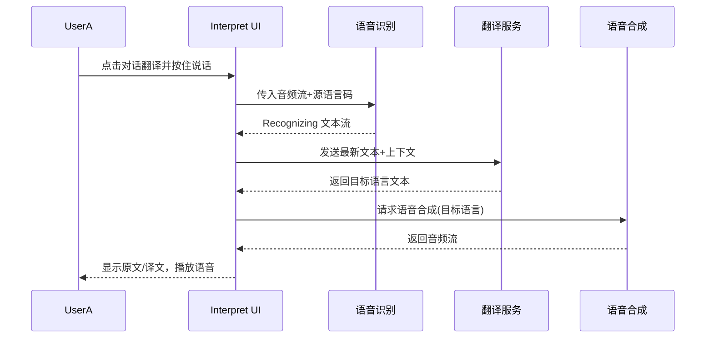

# AI Interpret 需求概要设计

- **版本**：V0.3（参考需求文档2024-11-12版本）
- **作者**：任传航（【假设】当前整理人：AI 助手）
- **日期**：【假设】2026-04-10

---

## 1. 概述
### 1.1 背景
- 全球化推动跨地域交流，语言障碍是国际出行、商务与学习的主要阻塞点。
- TCL 计划在 Android V 及以上系统的手机与平板上提供独立的 AI 翻译应用 Interpret，通过语音、文本、拍照等模式实现实时、多语言沟通。

### 1.2 目标
1. 支持多语言对的实时与离线互译，覆盖文本、对话、同声传译及拍照翻译等主流场景。
2. 集成微软 ASR/TTS 与 Google MT/拍照翻译能力，保障翻译质量与语音交互体验。
3. 通过语言包管理、AI Core Service 统一模型调度，提升 APK 体积控制和后续扩展效率。

### 1.3 范围
- TCL Android 手机/平板海外项目，系统预置不可卸载，通过桌面、侧边栏、设置和 TCL AI 入口启动。
- 模块覆盖：语音识别、语音合成、翻译、语言管理、网络管理、本地数据、UI 交互以及监控埋点。

### 1.4 非目标
- 不覆盖 iOS/非 Android 平台。
- 不自行训练/托管大语言模型，依赖第三方云服务与 AI Core。
- 不提供企业级多租户或后台运营能力，仅面向终端用户。

---

## 2. 术语与缩略语
| 术语 | 全称 | 说明 |
| --- | --- | --- |
| ASR | Automatic Speech Recognition | 自动语音识别，将音频流转为文本。 |
| TTS | Text-to-Speech | 文本转语音，输出自然语音反馈。 |
| MT | Machine Translation | 机器翻译，将源语言文本翻译为目标语言。 |
| SDK | Software Development Kit | 软件开发工具包，封装第三方能力供调用。 |
| AI Core Service | AI Core Service | TCL 公共 AI 能力平台，统一管理外部模型与服务。 |

---

## 3. 需求说明
### 3.1 用户画像/场景
- **跨国游客/留学生**：需要快速理解本地语言标识、与服务人员沟通。
- **海外商务人士**：在会议、通话中需要实时语音互译与同声传译。
- **内容消费者**：通过拍照翻译宣传册、菜单等图片文字。

### 3.2 用户故事
1. 作为海外游客，我希望打开 Interpret 进行双语对话，让双方能实时看到翻译字幕并听到语音朗读。
2. 作为商务用户，我需要在会议中使用同声传译模式，一方讲话即可在另一方设备上实时显示/播报翻译结果。
3. 作为学生，我想拍照翻译教科书，并在离线网络下仍可查看翻译结果。

### 3.3 功能列表（含优先级）
| 功能 | 描述 | 优先级 |
| --- | --- | --- |
| 对话翻译 | 双屏/分栏实时语音互译，支持字幕和语音播放 | P0 |
| 文本翻译 | 输入文本或粘贴内容，快速获得翻译结果与复制分享 | P0 |
| 同声传译 | 持续语音监听+翻译+朗读，支持全句校对 | P0 |
| 拍照翻译 | 调用 Google Lens 进行图片文字识别与翻译 | P1 |
| 语言管理 | 语言包列表、下载、删除、源/目标语言设置 | P1 |
| 模型/语言包下载 | 连接 TCL Cloud 下载 ASR/TTS 离线模型，Google SDK 下载翻译包 | P1 |
| 监控与反馈 | 埋点采集、反馈入口、隐私政策跳转 | P1 |
| 权限与设置引导 | 跳转系统设置授权麦克风、相机、存储等权限 | P2 |

### 3.4 约束
- 平台：Android V 及以上，芯片平台需兼容 MTK/QCOM/展锐，覆盖高中低端机型。
- 海外项目：因使用 Google 翻译 SDK，需符合海外发行要求。
- 权限：相机、麦克风、存储、网络等需在首次使用时获取。
- 合规：遵循 GDPR 等隐私法规，提供隐私政策、数据加密与访问控制。

---

## 4. 总体方案
### 4.1 架构概述
- Interpret 为系统内独立应用，以 MVI 与组件化设计实现模块解耦，UI 层调用核心服务层，再经 AI Core Service 访问第三方云能力。
- 语言包与模型下载由语言管理模块协调，ASR/TTS 由微软服务提供，MT、拍照翻译由 Google 服务提供，所有能力通过网络管理层与本地缓存层整合。

```mermaid
graph TD
    A[入口层<br/>桌面/Sidebar/Settings/TCL AI] --> B[UI 层<br/>主界面·对话·文本·同声传译·拍照]
    B --> C[业务逻辑层<br/>翻译会话管理·会话状态机]
    C --> D[核心服务层]
    D --> D1[ASR Service (微软)]
    D --> D2[TTS Service (微软)]
    D --> D3[MT/Photo MT (Google)]
    D --> D4[语言包管理·模型缓存]
    D4 --> E[TCL Cloud/Google SDK]
    C --> F[数据层·本地DB/缓存·日志埋点]
    F --> G[BI 监控/反馈/隐私]
```

### 4.2 关键设计决策
- **第三方能力组合**：语音能力采用微软 ASR/TTS（离线+在线），文本/拍照翻译采用 Google MT/Lens，保证各自领域最佳效果。
- **AI Core 服务**：通过公共 AI Core 将模型统一下载、管理与调用，降低 APK 体积并方便更新。
- **语言支持不对齐处理**：在语言选择 UI 中区分语音与文本可用列表，避免因能力差异导致用户错误选择。
- **安全与合规**：数据传输 HTTPS，模型与语言包加密存储；引入隐私政策与权限透明提示。

### 4.3 模块划分
| 模块 | 说明 |
| --- | --- |
| UI 模块 | 首页、对话翻译、文本翻译、同声传译、语言管理、拍照翻译、设置引导 |
| 语音识别模块 | 集成微软 ASR，负责录音、实时/整句识别、异常回传 |
| 语音合成模块 | 调用微软 TTS，播报翻译文本，支持多语音包 |
| 翻译模块 | 统一文本翻译接口、会话上下文管理、AI Core 服务编排 |
| 语言管理模块 | 语言列表、源/目标语言缓存、语言包下载/删除 |
| 网络管理模块 | 请求调度、重试、错误码映射、带宽/功耗控制 |
| 本地数据模块 | Room/SQLite 缓存历史记录、语言包信息、埋点数据 |
| 监控与反馈模块 | BI 埋点、日志上传、意见反馈、隐私与版本信息 |

---

## 5. 详细设计
### 5.1 主路径流程（对话翻译）


### 5.2 异常/边界流程
1. **网络不可用**：网络管理模块侦测离线 -> UI 提示切换离线模式；若对应语言包缺失，则引导下载/提示受限功能。
2. **语言支持不一致**：语言管理检测到语音与文本列表差异 -> UI 将不可用语言置灰并提示“仅文本可用/仅语音可用”。
3. **整句校对**：ASR Recognized 输出与持续 Recognizing 结果冲突时，UI 根据句号/停顿点进行替换，并触发 TTS 重播。

### 5.3 模块内部要点
- **语音识别模块**：双监听接口（实时/整句），支持暂停/恢复，错误码上报（网络、权限、模型损坏）。
- **翻译模块（拍照翻译）**：通过 Intent 调用 `com.google.android.apps.search.lens.LensActivity`，回传结果后在本地渲染；异常时引导用户在 Settings 授权相机。
- **语言管理模块**：
  - 提供 `getSupportedLanguages()`、`getLanguageSetting()`、`updateLanguageSetting()`、`downloadLanguagePack(code)`、`deleteLanguagePack(code)`。
  - 翻译语言包通过 Google SDK，语音语言包通过 TCL Cloud（ASR/TTS）。

### 5.4 数据模型
| 实体 | 字段 | 说明 |
| --- | --- | --- |
| LanguagePack | `id`, `type (asr/tts/mt)`, `langCode`, `displayName`, `downloadStatus`, `size`, `source` | 管理语言包基础信息与来源 |
| TranslationSession | `sessionId`, `mode`, `sourceLang`, `targetLang`, `history[]`, `timestamp`, `networkType` | 记录翻译会话、上下文与回放记录 |
| MonitoringEvent | `eventId`, `eventType`, `payload`, `timestamp`, `deviceInfo` | 埋点/错误日志上报到 BI |

### 5.5 接口设计
| 接口 | 入参 | 出参 | 说明 |
| --- | --- | --- | --- |
| ASR Service | `audioStream`, `langCode`, `sessionId` | `partialText`, `finalText`, `confidence`, `errorCode` | 语音转文本，支持 Recognizing/Recognized 双通道 |
| MT Service | `sourceText`, `sourceLang`, `targetLang`, `contextId` | `translatedText`, `alternatives[]`, `errorCode` | 文本翻译，含上下文 ID 支持连续对话 |
| TTS Service | `text`, `voiceId`, `targetLang`, `speed`, `pitch` | `audioStream`, `duration`, `errorCode` | 文本转语音 |
| Google Lens Intent | `ACTION_VIEW`, `uri`, `className` | `translatedImage`, `textBlocks[]` | 拍照翻译调用 | 
| Language Management API | `languageCode`, `action` | `status`, `progress` | 下载/删除语言包 |
| Privacy/Feedback SDK | `token`, `deviceInfo` | `resultCode` | 调用隐私中心与意见反馈 |
| AOTA Version | `packageName` | `versionInfo` | 查询应用版本 |

### 5.6 状态与错误处理
- 录音状态：`Idle -> Recording -> Paused -> Processing -> Completed/Failed`，异常重试 3 次后上报。
- 网络/权限异常：统一 `ErrorCenter` 映射用户可读提示，并在日志中记录错误码+上下文。
- 并发：语音识别、翻译、TTS 使用线程池，主线程仅负责 UI；下载任务独立调度，互斥写入语言包目录。

---

## 6. 非功能性需求
| 维度 | 目标 |
| --- | --- |
| 性能 | 对话模式端到端延迟 ≤ 1.5s；文本翻译响应 ≤ 800ms；应用冷启动 ≤ 2.5s。 |
| 功耗 | 语音长连接时动态调度录音采样率与网络心跳，后台闲置自动降级。 |
| 内存 | 常驻增量 ≤ 80MB；翻译会话缓存按 LRU 限制 20 条。 |
| 可靠性 | 崩溃率 < 0.1%，语音/网络异常自动重试或降级到离线语言包。 |
| 安全性 | 数据传输全链路 HTTPS，加密存储语言包，访问控制仅授权用户，符合 GDPR。 |
| 可维护性 | 模块化/MVI 架构、组件化解耦，提供调试开关与日志开关。 |
| 可测试性 | 支持 adb shell、状态机测试、埋点验证、测试 APK 调试模式。 |
| 可观测性 | 接入 BI 埋点、错误日志上传、监控节点按需求矩阵配置。 |
| 兼容性 | 支持 MTK/QCOM/展锐主流平台，Android V 及以上系统。 |
| 全球化 | UI 与语音资源支持多语言，基于 FCM/feature 配置控制区域差异。 |

---

## 7. 验收标准与测试建议
1. 功能验收：
   - 覆盖对话、文本、同声传译、拍照、语言管理、离线模式等核心流程。
   - 语言包下载、删除、切换记录准确，语言列表显示符合支持矩阵。
2. 性能验收：
   - 各模式在弱网/离线条件下的响应时间达标，CPU/GPU/功耗监控符合指标。
3. 安全与隐私：
   - 启动时展示隐私政策，用户可随时查看，数据收集经用户授权。
4. 可测试性：
   - 日志开关、埋点校验脚本、Mock API/离线包测试工具可用。

---

## 8. 风险与应对
| 风险 | 等级 | 应对 |
| --- | --- | --- |
| 外部 AI 模型更新节奏与应用发行不同步 | 中 | 通过 AI Core 公共服务统一管理模型版本，预留灰度更新通道。 |
| 语音与文本语言支持不一致 | 中 | UI 分离语言列表并提示适用范围，与 GD 调整逻辑覆盖差异。 |
| APK 体积受离线模型影响 | 低 | 模型按需下载，采用语言包压缩与共享存储策略。 |
| 网络/权限异常导致功能受限 | 中 | 启动前置权限检测，提供离线提示与跳转设置。 |
| 隐私合规风险 | 中 | 数据加密、明示隐私政策、提供数据删除/退出机制。 |

---

## 9. 待确认问题
1. 离线翻译包的具体语言清单与容量上限是否与 Google/微软最新版本一致？
2. 是否需要在国内 ROM 或无 Google 服务环境下提供降级方案？
3. BI 监控埋点的事件清单、指标口径及触发频率是否已有最终确认？
4. `req-outline-output.md` 交付后是否需要同步到 Confluence 或其他知识库？
