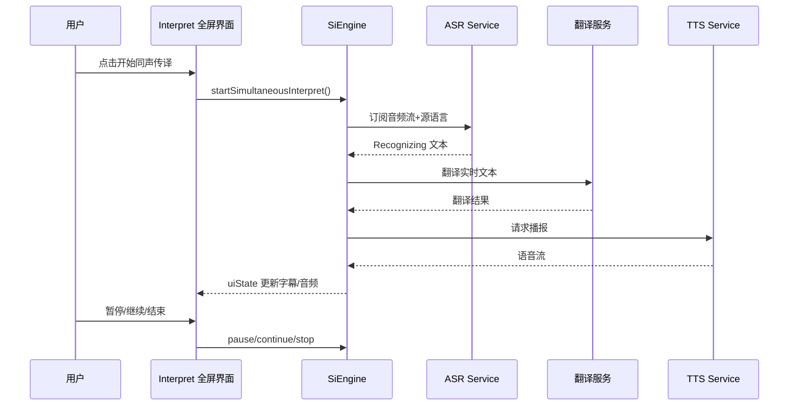
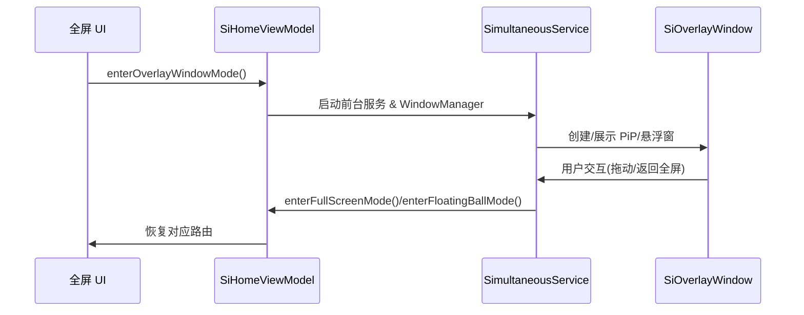

# AI Interpret 2.06 需求概要设计

- **版本**：V0.3（整合 Interpret V0.3 与 2.06 二期需求）
- **作者**：【假设】AI 助手
- **日期**：【假设】2026-04-14

---

## 1. 概述
### 1.1 背景
- 全球化沟通与海外出行场景激增，语言障碍限制用户跨语种交流，TCL 计划在海外 Android V 及以上机型内置 AI Interpret，实现语音、文本、拍照等多模态实时互译。（``49:72:openspec/specs/AIInterpret/AIInterpret.txt``）
- 蒙娜丽莎高端机型需搭配 TCL 耳机推出 AI 同声传译二期，满足商务会议沉浸式翻译、耳机卖点差异化。（``5:9:openspec/specs/AIInterpret/AIinterpret_2.06.txt``）

### 1.2 目标
1. 覆盖多语言对实时/离线翻译、对话翻译、同声传译、文本与拍照翻译等主流场景。（``69:125:openspec/specs/AIInterpret/AIInterpret.txt``）
2. 结合微软 ASR/TTS、Google 翻译/Lens 与 AI Core 统一模型管理，确保音视频体验与扩展性。（``91:170:openspec/specs/AIInterpret/AIInterpret.txt``）
3. 二期新增沉浸模式、历史记录编辑/分享、画中画、异常兜底、无障碍、暗黑模式与埋点增强。（``13:33:openspec/specs/AIInterpret/AIinterpret_2.06.txt``）

### 1.3 范围
- 适用 TCL 海外 Android 手机/平板，系统预装不可卸载，可从桌面、侧边栏、Settings、TCL AI 启动。（``66:131:openspec/specs/AIInterpret/AIInterpret.txt``）
- 功能覆盖语音识别、语音合成、翻译、语言/模型管理、网络、本地数据、监控反馈及 2.06 新增特性。（``132:170:openspec/specs/AIInterpret/AIInterpret.txt``）（``13:33:openspec/specs/AIInterpret/AIinterpret_2.06.txt``）

### 1.4 非目标
- 不支持 iOS 或非 Android 平台；不自研大模型，仅编排第三方能力；暂不提供企业级多租户后台。（``24:34:openspec/specs/AIInterpret/AIInterpret.txt``）

---

## 2. 术语与缩略语
| 术语 | 全称 | 说明 |
| --- | --- | --- |
| ASR | Automatic Speech Recognition | 自动语音识别，将音频流转换为文本。 | 
| TTS | Text-to-Speech | 文本转语音，输出自然语音反馈。 |
| MT | Machine Translation | 机器翻译，将源语言文本翻译为目标语言。 |
| SDK | Software Development Kit | 封装第三方能力供应用调用。 |
| AI Core Service | AI Core Service | TCL 公共 AI 能力平台，统一模型管理与服务编排。 |
（``19:40:openspec/specs/AIInterpret/AIInterpret.txt``）

---

## 3. 需求说明
### 3.1 用户画像与场景
- **跨国游客/留学生**：需要随时翻译标识、交流及学习材料。（``49:72:openspec/specs/AIInterpret/AIInterpret.txt``）
- **商务人士**：会议中依赖同声传译、沉浸模式与画中画配合耳机使用。（``5:20:openspec/specs/AIInterpret/AIinterpret_2.06.txt``）
- **内容消费者**：拍照/文本翻译快速获取资讯，并希望历史记录可编辑/分享。（``13:33:openspec/specs/AIInterpret/AIinterpret_2.06.txt``）

### 3.2 用户故事
1. 作为海外游客，我希望通过对话翻译实时看到双语字幕并可语音播报，方便现场沟通。（``69:134:openspec/specs/AIInterpret/AIInterpret.txt``）
2. 作为商务用户，我需要在会议中启动同声传译沉浸模式，并可随时切换画中画或悬浮窗以配合耳机使用。（``13:41:openspec/specs/AIInterpret/AIinterpret_2.06.txt``）
3. 作为学习者，我想在离线环境下查看拍照翻译结果并从历史记录中编辑、分享重点句子。（``13:24:openspec/specs/AIInterpret/AIinterpret_2.06.txt``）

### 3.3 功能清单与优先级
| 功能 | 描述 | 优先级 |
| --- | --- | --- |
| 对话翻译 | 双屏/分栏实时语音互译与字幕展示。 | P0 |
| 文本翻译 | 输入文本快速翻译，可复制/分享。 | P0 |
| 同声传译 | 连续语音监听、整句校对、沉浸模式。 | P0 |
| 历史记录编辑/分享 | 按会话整理翻译记录，允许编辑、导出。 | P0 |
| 画中画模式 | 全屏/悬浮窗/浮球切换，支持前台服务保持会话。 | P0 |
| 网络/服务器/敏感词/系统异常兜底 | 异常提示、重试与风险隔离。 | P0 |
| 无障碍&暗黑模式 | 提供读屏、色彩反转、暗色主题。 | P0 |
| 功能埋点 | BI 监控、日志采集。 | P0 |
| 语言包管理 | 语言列表、下载/删除、源/目标同步。 | P1 |
| 拍照翻译 | 调用 Google Lens 识别图片文字。 | P1 |
（``13:170:openspec/specs/AIInterpret/AIinterpret_2.06.txt``）（``132:215:openspec/specs/AIInterpret/AIInterpret.txt``）

### 3.4 约束
- 平台：Android V+，需兼容 MTK/QCOM/展锐，覆盖高中低端机型。（``66:90:openspec/specs/AIInterpret/AIInterpret.txt``）
- 海外项目：因使用 Google SDK，仅面向海外市场。（``66:72:openspec/specs/AIInterpret/AIInterpret.txt``）
- 权限：悬浮窗需 `TYPE_APPLICATION_OVERLAY` 与前台服务保证存活，需引导授权 `SYSTEM_ALERT_WINDOW`。（``34:41:openspec/specs/AIInterpret/AIinterpret_2.06.txt``）
- 生命周期：网络/电话/蓝牙监听、ASR/翻译/TTS 需迁移至进程单例与 ForegroundService 解耦 Activity。（``38:41:openspec/specs/AIInterpret/AIinterpret_2.06.txt``）
- 安全与合规：数据加密、访问控制、GDPR 隐私提示。（``87:169:openspec/specs/AIInterpret/AIInterpret.txt``）

---

## 4. 总体方案
### 4.1 架构概述
Interpret 作为独立系统应用，入口层（桌面/Sidebar/Settings/TCL AI）进入 UI 层；业务逻辑层调度语音、翻译、语言管理等模块，通过 AI Core Service 访问微软 ASR/TTS、Google MT/Lens，并由语言包管理协调 TCL Cloud/Google SDK 下载；基础层提供日志、数据库、网络、共享 View 支撑。（``111:137:openspec/specs/AIInterpret/AIInterpret.txt``）

```mermaid
graph TD
    A[入口层<br/>桌面/Sidebar/Settings/TCL AI] --> B[UI 层<br/>主界面·对话·文本·同声传译·画中画]
    B --> C[会话引擎层<br/>SiEngine/SiController]
    C --> D1[语音识别-ASR (微软)]
    C --> D2[翻译/拍照MT (Google)]
    C --> D3[语音合成-TTS (微软)]
    C --> D4[语言管理/模型缓存]
    D4 --> E1[TCL Cloud 离线包]
    D4 --> E2[Google SDK 语言包]
    C --> F[监控与本地数据]
    F --> G[BI/隐私/反馈 SDK]
```

### 4.2 模块划分
| 模块 | 说明 |
| --- | --- |
| UI 层 | 主界面、对话、文本、同声传译、画中画/浮窗、语言设置、暗黑/无障碍开关。 |
| SiHomeViewModel / SiOverlayViewModel | 订阅 SiEngine 状态，驱动全屏与悬浮窗 UI；保持独立生命周期。（``104:130:openspec/specs/AIInterpret/AIinterpret_2.06.txt``）|
| SimultaneousService | 前台服务持有悬浮窗、绑定引擎，处理权限与生命周期。（``115:120:openspec/specs/AIInterpret/AIinterpret_2.06.txt``）|
| SiEngine & Controller | 管理 ASR/TTS/翻译/录音、系统监听、仓储写入。（``121:125:openspec/specs/AIInterpret/AIinterpret_2.06.txt``）|
| 语音识别/合成模块 | 集成微软服务，支持实时/整句监听与语音播报。（``182:204:openspec/specs/AIInterpret/AIInterpret.txt``）|
| 翻译模块 | 统一文本/对话/拍照翻译接口，调用 Google Lens Intent。（``187:200:openspec/specs/AIInterpret/AIInterpret.txt``）|
| 语言管理模块 | 语言列表、下载/删除、设置同步。（``205:218:openspec/specs/AIInterpret/AIInterpret.txt``）|
| 本地数据/监控模块 | 数据库、埋点、BI 分析、意见反馈、隐私配置。（``223:230:openspec/specs/AIInterpret/AIInterpret.txt``）|

### 4.3 关键设计决策
- 前台服务 + 悬浮窗架构确保同声传译会话在后台存活，浮窗/画中画自由切换。（``34:130:openspec/specs/AIInterpret/AIinterpret_2.06.txt``）
- 语言支持差异由语言管理模块拆分语音与文本语言列表，UI 置灰并提示。（``158:170:openspec/specs/AIInterpret/AIInterpret.txt``）
- 全句校对通过 ASR Recognizing/Recognized 双通道与标点策略替换，保证字幕准确。（``165:170:openspec/specs/AIInterpret/AIInterpret.txt``）

---

## 5. 详细设计
### 5.1 主路径流程（同声传译全屏模式）

（``128:170:openspec/specs/AIInterpret/AIInterpret.txt``）（``286:314:openspec/specs/AIInterpret/AIinterpret_2.06.txt``）

### 5.2 画中画/悬浮窗流程

（``81:130:openspec/specs/AIInterpret/AIinterpret_2.06.txt``）

### 5.3 异常/边界处理
1. **网络异常**：ConnectivityManager 回调触发 `pauseSimultaneousInterpret()`，UI 提示弱网并允许离线语言包重试。（``63:76:openspec/specs/AIInterpret/AIinterpret_2.06.txt``）
2. **服务器异常**：SiEngine 捕获错误码，调用 `retry()`，若仍失败则提示并记录埋点。（``286:314:openspec/specs/AIInterpret/AIinterpret_2.06.txt``）
3. **敏感词/系统异常**：检测到敏感词或系统资源不足时停止会话、提示用户并保留记录。（``18:23:openspec/specs/AIInterpret/AIinterpret_2.06.txt``）
4. **语音/文本语言不一致**：UI 置灰不可用语言并提示仅文本/语音可用。（``158:165:openspec/specs/AIInterpret/AIInterpret.txt``）

### 5.4 数据模型
| 实体 | 字段 | 说明 |
| --- | --- | --- |
| TranslationSession | `sessionId`, `mode`, `sourceLang`, `targetLang`, `status`, `history[]`, `createdAt`, `deviceInfo` | 记录会话与历史文本，支撑编辑/分享。（``13:24:openspec/specs/AIInterpret/AIinterpret_2.06.txt``）|
| HistoryItem | `text`, `translatedText`, `timestamp`, `speaker`, `confidence`, `tags` | 支撑整句校对、敏感词标记与分享。（``165:170:openspec/specs/AIInterpret/AIInterpret.txt``）|
| OverlayState | `x`, `y`, `size`, `mode`, `locked`, `route` | 悬浮窗位置与模式，用 DataStore 持久化。（``126:129:openspec/specs/AIInterpret/AIinterpret_2.06.txt``）|
| LanguagePack | `langCode`, `type`, `status`, `size`, `source` | 管理 ASR/TTS/MT 语言包。（``205:214:openspec/specs/AIInterpret/AIInterpret.txt``）|

### 5.5 接口设计
| 接口 | 入参 | 出参 | 说明 |
| --- | --- | --- | --- |
| `startSimultaneousInterpret()` 等 | `mode`, `sourceLang`, `targetLang` | `resultCode` | SiEngine/Service 控制同声传译生命周期。（``300:314:openspec/specs/AIInterpret/AIinterpret_2.06.txt``）|
| ASR Service | `audioStream`, `langCode`, `sessionId` | `partialText`, `finalText`, `errorCode` | 语音识别，AI Core/ASR Service。（``221:224:openspec/specs/AIInterpret/AIInterpret.txt``）|
| MT Service | `sourceText`, `sourceLang`, `targetLang`, `contextId` | `translatedText`, `errorCode` | 文本翻译接口。（``224:225:openspec/specs/AIInterpret/AIInterpret.txt``）|
| TTS Service | `text`, `voiceId`, `langCode` | `audioStream`, `duration`, `errorCode` | 语音合成接口。（``225:226:openspec/specs/AIInterpret/AIInterpret.txt``）|
| Google Lens Intent | `ACTION_VIEW`, `uri`, `className` | 翻译结果或图片 URL | 拍照翻译调用。（``187:200:openspec/specs/AIInterpret/AIInterpret.txt``）|
| 权限/反馈/隐私 SDK | `token`, `context` | `resultCode` | 调用隐私政策/反馈入口。（``226:230:openspec/specs/AIInterpret/AIInterpret.txt``）|
| Language Management API | `languageCode`, `action` | `status`, `progress` | 下载/删除语音或翻译语言包。（``205:214:openspec/specs/AIInterpret/AIInterpret.txt``）|

### 5.6 状态机与并发
- 会话状态：`Idle → Recording → Translating → Broadcasting → Completed/Failed`，异常重试 ≤3 次后上报。（``165:170:openspec/specs/AIInterpret/AIInterpret.txt``）
- 并发：ASR/翻译/TTS 使用线程池，下载任务与 UI 线程隔离；悬浮窗运行在前台服务，支持多线程通信机制。（``278:287:openspec/specs/AIInterpret/AIInterpret.txt``）

---

## 6. 非功能性需求
| 维度 | 目标 |
| --- | --- |
| 性能 | 对话端到端延迟 ≤1.5s；同声传译二期需与一期性能持平（CPU/内存/流畅度/启动时间）。 （``168:177:openspec/specs/AIInterpret/AIInterpret.txt``）（``28:30:openspec/specs/AIInterpret/AIinterpret_2.06.txt``）|
| 功耗 | 录音、ASR、网络、蓝牙、TTS 等高功耗功能与一期持平；后台降级策略。 （``29:30:openspec/specs/AIInterpret/AIinterpret_2.06.txt``）|
| 安全/合规 | 复用一期安全报告，遵循 GDPR，数据加密、访问控制、隐私告知。 （``31:33:openspec/specs/AIInterpret/AIinterpret_2.06.txt``）（``87:170:openspec/specs/AIInterpret/AIInterpret.txt``）|
| DFX | 覆盖性能、功耗、可靠性、维护、测试、可配置、兼容性与全球化要求。 （``236:278:openspec/specs/AIInterpret/AIInterpret.txt``）|
| 可靠性 | 崩溃率 <0.1%，异常自动重试或离线降级。（``236:274:openspec/specs/AIInterpret/AIInterpret.txt``）|
| 可维护性/可测试性 | 模块化解耦、日志开关、adb 测试、埋点验证、前台服务调试。（``254:263:openspec/specs/AIInterpret/AIInterpret.txt``）|
| 兼容性 | 支持 Android V+ 及 MTK/QCOM/展锐芯片，特性差异通过 feature/FCM 配置。（``265:273:openspec/specs/AIInterpret/AIInterpret.txt``）|

---

## 7. 验收标准与测试建议
1. **功能验收**：全覆盖对话、文本、同声传译（含沉浸/画中画/悬浮窗）、历史编辑分享、拍照翻译、语言包管理及异常兜底流程。（``13:233:openspec/specs/AIInterpret/AIinterpret_2.06.txt``）
2. **性能/功耗**：对齐一期基线，验证端到端延迟、CPU、内存、功耗、启动时间。（``28:33:openspec/specs/AIInterpret/AIinterpret_2.06.txt``）
3. **安全合规**：检查隐私政策、权限提示、数据加密、敏感词处理。（``87:170:openspec/specs/AIInterpret/AIInterpret.txt``）
4. **可测试性**：ADB Shell、日志、埋点、测试 APK 调试模式可用。（``258:263:openspec/specs/AIInterpret/AIInterpret.txt``）

---

## 8. 风险与应对
| 风险 | 等级 | 应对 |
| --- | --- | --- |
| AI 语言模型体积过大影响 APK | 中 | 依赖 AI Core 统一模型下载与共享存储，按需加载。（``149:154:openspec/specs/AIInterpret/AIInterpret.txt``）|
| 语音与文本语言支持不一致 | 中 | UI 分离列表并提示，GD 调整逻辑。（``155:165:openspec/specs/AIInterpret/AIInterpret.txt``）|
| 悬浮窗权限/后台限制导致会话中断 | 中 | 前台服务 + 权限引导 + 系统通知保持运行。（``34:41:openspec/specs/AIInterpret/AIinterpret_2.06.txt``）|
| 敏感词或合规问题 | 中 | 敏感词过滤与日志留存，必要时停止会话。（``18:23:openspec/specs/AIInterpret/AIinterpret_2.06.txt``）|
| 外部服务更新节奏与应用不一致 | 低 | 通过 AI Core 管理版本并提供灰度策略。（``149:154:openspec/specs/AIInterpret/AIInterpret.txt``）|

---

## 9. 待确认问题
1. 沉浸模式 UI 与耳机交互规范是否已有最终稿？（``13:18:openspec/specs/AIInterpret/AIinterpret_2.06.txt``）
2. 历史记录编辑/分享的合规策略、格式与落盘周期需要确认。（``13:23:openspec/specs/AIInterpret/AIinterpret_2.06.txt``）
3. 敏感词命中后的提示文案与上报范围是否需与隐私/法务同步确认？（``18:23:openspec/specs/AIInterpret/AIinterpret_2.06.txt``）
4. 画中画/悬浮窗在不同 ROM（Android 8.0+）上的前台服务与通知样式是否需定制？（``34:41:openspec/specs/AIInterpret/AIinterpret_2.06.txt``）
5. DFX 测试指标口径、埋点事件清单是否与 BI/测试团队对齐？（``28:33:openspec/specs/AIInterpret/AIinterpret_2.06.txt``）（``236:263:openspec/specs/AIInterpret/AIInterpret.txt``）
